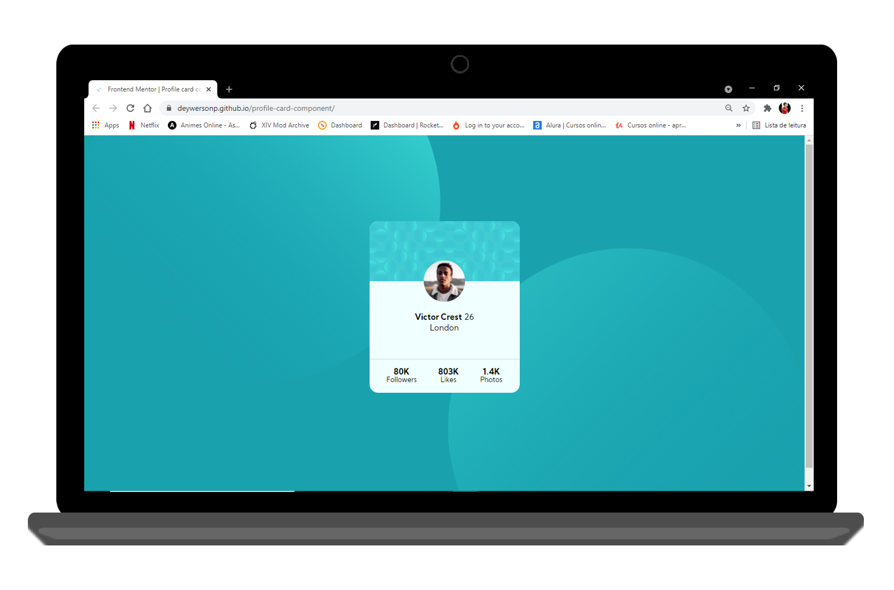

<h1 align="center">
 TODO List
</h1>

  <a href="#-project">Project</a>&nbsp;&nbsp;&nbsp;|&nbsp;&nbsp;&nbsp;
  <a href="#-technologies">Technologies</a>&nbsp;&nbsp;&nbsp;|&nbsp;&nbsp;&nbsp;
  <a href="#-services-used">Services Used</a>&nbsp;&nbsp;&nbsp;|&nbsp;&nbsp;&nbsp;
  <a href="#-getting-started">Getting Started</a>&nbsp;&nbsp;&nbsp;|&nbsp;&nbsp;&nbsp;
  <a href="#-features">Features</a>&nbsp;&nbsp;&nbsp;

 

 

  

## 💻 Project

This project was developed to answer the challenge from [Frontend Mentor](https://www.frontendmentor.io) where we can find challenges that help us to improve our coding skills by building realistic projects.

 

This application is hosted on GitHub Pages, [click here to see it](https://deywersonp.github.io/profile-card-component/).

  

## 🚀 Technologies

This project was developed using these techs:

- [HTML](https://developer.mozilla.org/pt-BR/docs/Web/HTML)
- [CSS](https://developer.mozilla.org/pt-BR/docs/Web/CSS)

 

## 👨‍🔧 Services Used

- GitHub
- [GitHub Pages](https://pages.github.com/)

 

## 🎮 Getting Started

If you want run this code, you can start cloning the repository using HTTP or SSH key.

- Open your git
- Type `git clone`
- Insert the HTTP or SSH key (on windows, shift + insert to paste on gitBash)
- You can find this HTTP or SSH Key by clicking on `Code` on the top right in this repository

- Once cloned you can open the project in your IDE and open the archive `index.html` on your browser.

  

## 🕵 Features

The main features of the application are:

 - View information for a profile on the card
 
 

 > In case of sensitive bugs like security vulnerabilities, please contact
 > <a href = "mailto:deywerson.pereira@gmail.com">deywerson.pereira@gmail.com</a> directly instead of using issue tracker. We value your effort
 > to improve the security and privacy of this project!
  
 
---
  

      
Please follow on github and join us! Thanks for visiting me and good coding!

Made with ♥ by <a href="https://github.com/deywersonp">Deywerson Pereira</a>
